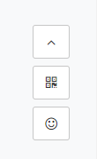

## bar.js


### 依赖
- Font Awesome
- Bootstrap Popovers
```
<link href="http://cdn.staticfile.org/font-awesome/4.7.0/css/font-awesome.min.css" rel="stylesheet">
<link href="http://cdn.staticfile.org/twitter-bootstrap/4.1.3/css/bootstrap.min.css" rel="stylesheet">

<script src="http://cdn.staticfile.org/jquery/3.3.1/jquery.min.js"></script>
<script src="http://cdn.staticfile.org/popper.js/1.14.4/umd/popper.min.js"></script>
<script src="http://cdn.staticfile.org/twitter-bootstrap/4.1.3/js/bootstrap.min.js"></script>
```

### 简介
自定义生成底部按钮栏, 可选按钮类型`回到顶部`, `显示图片按钮`, `转发到微博`

### 使用
```
ExBar.create({
  // ! 必选属性 *可选属性
  rootClass: "iclass",                  //* bar根元素class
  buttonClass: "iclass",                //* 按钮class
  buttons: [{
    type: "scrollTop",                  //! 按钮类型
    title: "回到顶部",                   //* 元素按钮title属性
    class: "iclass",                    //* 按钮class 覆盖 buttonClass
    icon: "star",                       //* 按钮图标 Font Awesome 图标名
    // 以上为所有按钮共有的属性
    
    selector: window,                   //* 滚动的容器 默认为window
    scrollDuration: 300                 //* 滚动时长 默认500
  }, {
    type: "image",
    title: "扫一扫",
    
    imageUrl: "qrcode.png",             //! 图片url
    imageClass: "iclass"                //* 图片class
  }, {
    type: "share",
    title: "分享到微博",
    
    shareTitle: "iweb",                 //* 分享文章标题 默认为 document.title
    shareContent: "content",            //* 文章内容 默认为 <meta name='description'> 的内容  
    shareImageUrl: "http://*.png"        //* 分享图片url http开头
  }]
});
```

